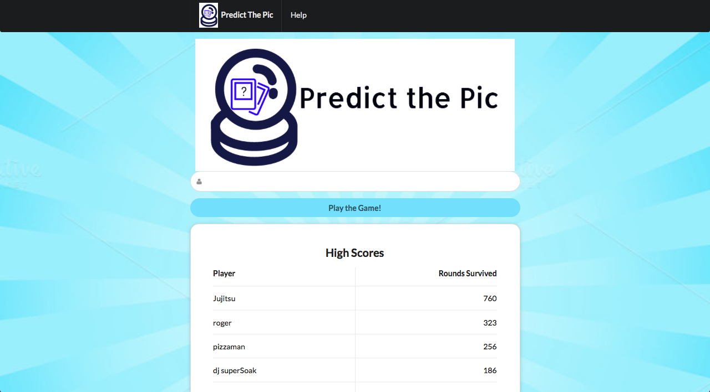
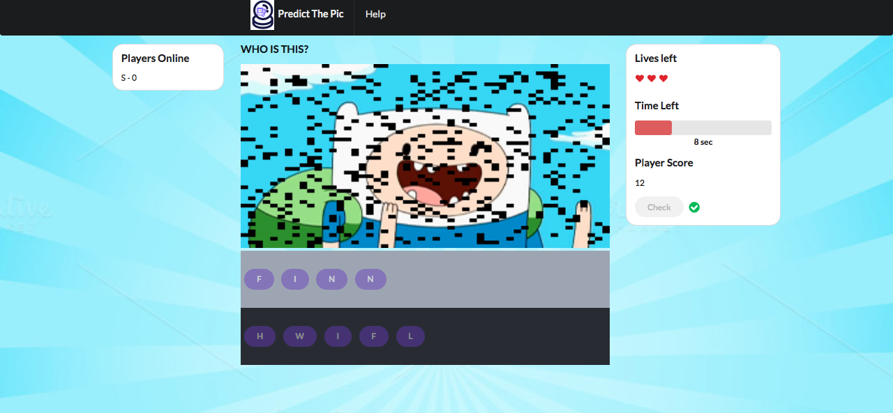

# GuessThePic
available at http://www.predictpic.us
##Frameworks, Modules, Libraries, etc:
- Semantic UI
- Node.js
- Express
- Socket.io
- Mongoose
- MongoDB
- Body parser
- Request

####How to execute program:
1) Install node_modules:
```sh
$ npm install
```
2) run foreman  or npm start to run all necessary applications.
```sh
$ foreman start
```
foreman run:
* mongoseDB
* node server.js
* node socketIO.js

The server is running on localhost:3000

the socket.io running on localhost:8080


# Game
## login screen
 
## Answered right 

